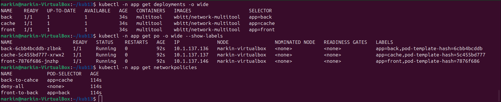
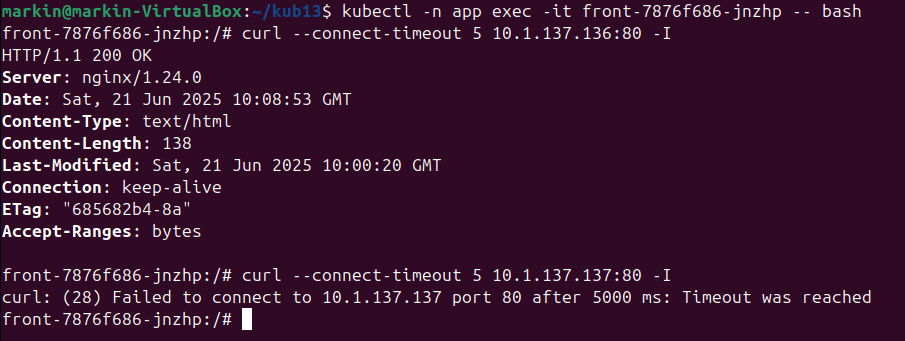
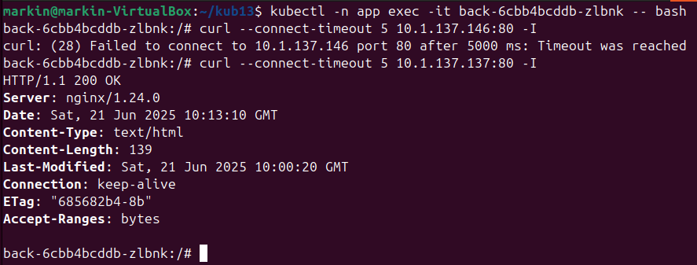
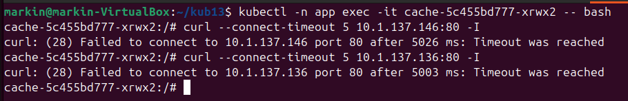

# Домашнее задание к занятию "`Как работает сеть в K8s`" - `Маркин Алексей`

### Цель задания

Настроить сетевую политику доступа к подам.

### Задание 1. Создать сетевую политику или несколько политик для обеспечения доступа

1. Создать deployment'ы приложений frontend, backend и cache и соответсвующие сервисы.
2. В качестве образа использовать network-multitool.
3. Разместить поды в namespace App.
4. Создать политики, чтобы обеспечить доступ frontend -> backend -> cache. Другие виды подключений должны быть запрещены.
5. Продемонстрировать, что трафик разрешён и запрещён.

### Решение

[front.yaml](./front.yaml)

[back.yaml](./back.yaml)

[cache.yaml](./cache.yaml)

[deny-all.yaml](./deny-all.yaml)

[front-to-back.yaml](./front-to-back.yaml)

[back-to-cahce.yaml](./back-to-cahce.yaml)

Подключение с frontend к backend и cache

Подключение с backend к frontend и cache

Подключение с cache к frontend и backend

### Правила приёма работы

1. Домашняя работа оформляется в своём Git-репозитории в файле README.md. Выполненное домашнее задание пришлите ссылкой на .md-файл в вашем репозитории.
2. Файл README.md должен содержать скриншоты вывода необходимых команд, а также скриншоты результатов.
3. Репозиторий должен содержать тексты манифестов или ссылки на них в файле README.md.